# 1 消息中间件概述

## 1.1 消息队列简介

消息队列(message queue)简称MQ，是一种以“**先进先出**”的数据结构为基础的消息服务器。

消息：两个系统间要传输的数据

作用：实现消息的传递


原始的数据传递方式：

  

上述的数据传输方式为同步传输【作为调用方必须等待被调用方执行完毕以后，才可以继续传递消息】，同步传输存在的弊端：**传输效率较低**。


基于MQ实现消息的传输，如下图所示：

  

上述的数据的传输方式属于异步传输【作为调用方法不用等待被调用方执行完毕就可以接续传递消息】，数据传输的效率较高。


## 1.2 消息队列应用场景

首先我们先说一下消息中间件的主要的作用：

**[1]系统解耦**

**[2]流量消锋**

**[3]数据分发**

上面的三点是我们使用消息中间件最主要的目的。


### 1.2.1 系统解耦

系统的耦合性越高，**容错性**【是指[系统](https://baike.baidu.com/item/系统/479832)在部分组件（一个或多个）发生故障时仍能正常运作的能力】就越低。以电商应用为例，用户创建订单后，如果耦合调用库存系统、物流系统、支付系统，任何一个子系统出了故障或者因为升级等原因暂时不可用，都会造成下单操作异常，影响用户使用体验。

如下下图所示：

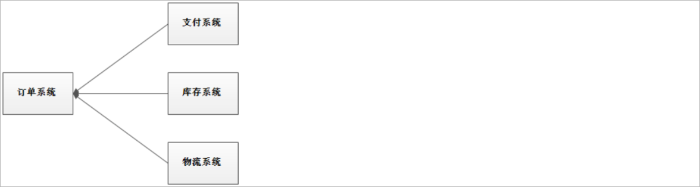 

使用消息队列以后，整个下单操作的架构如下图所示：

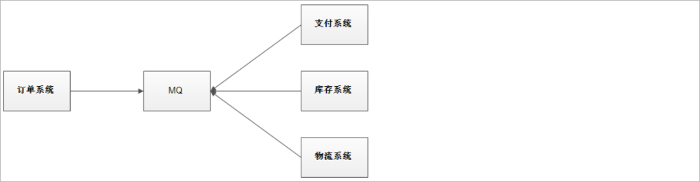 

使用消息队列解耦合，系统的耦合性就会降低了，容错性就提高了。比如物流系统发生故障，需要几分钟才能来修复，在这段时间内，物流系统要处理的数据被缓存到消息队列中，用户的下单操作正常完成。当物流系统回复后，补充处理存在消息队列中的订单消息即可，终端系统感知不到物流系统发生过几分钟故障。


### 1.2.2 流量消锋

流量消锋：消除系统中的高峰值流量(流量可以理解为就是请求)

现有一个电商系统下单初始架构如下所示：

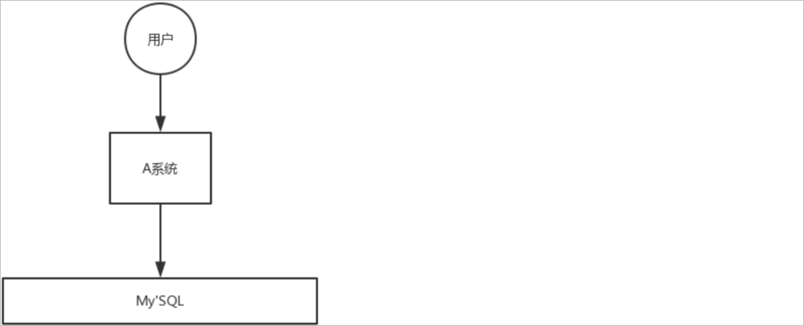 

假设用户每秒需要发送5k个请求，而我们的A系统每秒只能处理2K个请求，这样就会导致大量的下单请求失败。而且由于实际请求的数量远远超过系统的处理能力，此时也有可能导致系统宕机。

使用消息队列改进以后的架构如下所示：

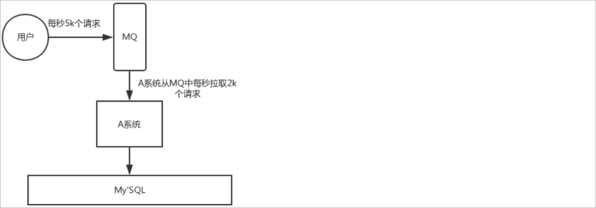 

用户每秒发送5k个请求，我们可以先将下单请求数据存储到MQ中，此时在MQ中就缓存了很多的下单请求数据，而A系统根据自己的处理能力从MQ中获取数据进行下单操作，有了MQ的缓存层以后，就可以保证每一个用户的下单请求可以得到正常的处理，并且这样可以大大提高系统的稳定性和用户体验。


### 1.2.3 异步通信

假设A系统进行了某一个业务操作以后，需要将这个业务操作结果通知给其他的系统，原始的架构如下所示：

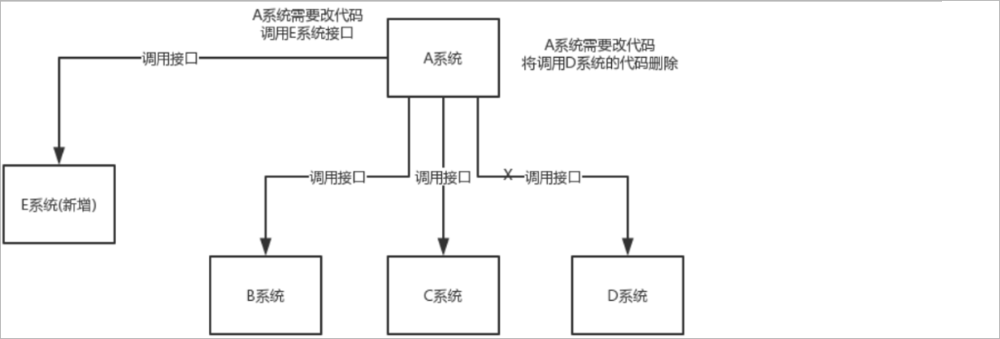 

此时B系统、C系统、D系统就需要提供对应的接口，然后让A系统进行调用。如果此时不需要通知D系统了，那么就需要更改A系统的代码，将调用D系统的代码删除掉。并且如此时项目中添加了一个新的系统E，A系统也需要将处理结果通知给E系统，那么同时也需要更改A系统的代码。这样就不利于后期的维护。

使用MQ改进以后的架构如下所示：

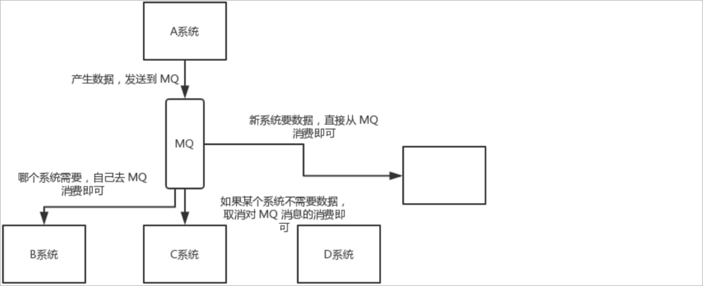 

A系统需要将业务操作结果通知给其他的系统时，A系统只需要将结果发送到MQ中。其他的系统只需要从MQ中获取结果即可，如果不需要结果了，此时只需要取消从MQ中获取结果的操作即可。并且如果新增了一个系统需要获取结果，只需要从MQ中获取结果数据就可以了，A系统的代码不需要进行改动。这样就大大的提高了系统的维护性。


## 1.3 MQ的优缺点

优点：

1、应用解耦提高了系统的容错性

2、流量消锋提高了系统的并发能力

3、异步通信提高了系统的可维护性

缺点：

1、系统可用性降低：系统引入的外部依赖越多，系统稳定性越差。一旦MQ宕机，就会对业务造成影响。

2、系统复杂度提高：MQ的加入大大增加了系统的复杂度。

MQ的选择依据是什么?  调用方是否需要获取到被调用方的执行结果，如果需要获取到结果，那么就需要使用同步通信，如果不需要就可以使用异步通信。


## 1.4 Kafka简介

Kafka是Apache开源的一款基于zookeeper协调的分布式消息系统，具有高吞吐率、高性能、实时、高可靠等特点，可实时处理流式数据。它最初由LinkedIn公司开发，使用Scala语言编写。

Kafka历经数年的发展，从最初纯粹的消息引擎，到近几年开始在流处理平台生态圈发力，多个组织或公司发布了各种不同特性的产品。

常见产品如下：

1、<font color="red">**Apache Kafka** ：最“正统”的Kafka也是开源版，它是后面其他所有发行版的基础</font>。

2、Cloudera/Hortonworks Kafka: 集成了目前主流的大数据框架，能够帮助用户实现从分布式存储、集群调度、流处理到机器学习、实时数据库等全方位的数据理。

3、Confluent Kafka ：主要提供基于Kafka的企业级流处理解决方案。


Apache Kafka，它现在依然是开发人数最多、版本迭代速度最快的Kafka，我们使用此产品学习。我们使用版本**kafka_2.13-2.8.1**

官网地址：https://kafka.apache.org/

下载：https://kafka.apache.org/downloads


## 1.5 MQ产品比对

市面上常见的消息队列产品：

1、ActiveMQ

2、RabbitMQ

3、RocketMQ

4、Kafka

常见特性比对：

| **特性                    ** | **ActiveMQ                **           | **RabbitMQ**                                                 | **RocketMQ**                                                 | **Kafka**                                                    |
| ---------------------------- | -------------------------------------- | ------------------------------------------------------------ | ------------------------------------------------------------ | ------------------------------------------------------------ |
| 开发语言                     | java                                   | erlang                                                       | java                                                         | scala                                                        |
| 单机吞吐量                   | 万级                                   | 万级                                                         | 10万级                                                       | 100万级                                                      |
| 时效性                       | ms                                     | us                                                           | ms                                                           | ms级以内                                                     |
| 可用性                       | 高（主从）                             | 高（主从）                                                   | 非常高（分布式）                                             | 非常高（分布式）                                             |
| 功能特性                     | 成熟的产品、较全的文档、各种协议支持好 | 并发能力强、性能好、延迟低，社区活跃度高，数据量没有那么大，优先选择功能比较完备的RabbitMQ | MQ功能比较完善，扩展性佳，可靠性要求高的金融互联网领域使用多,稳定性高，经历了多次阿里双11考验 | 只支持主要的MQ功能，大数据领域使用多，追求高吞吐量，适合产生大量数据的互联网服务的数据收集业务 |


# 2 Kafka环境搭建

## 2.1 Kafka集群机制

集群机制说明：

1、Kafka是**天然支持集群**的，哪怕是一个节点实际上也是集群模式

2、Kafka集群依赖于zookeeper进行协调，并且在早期的Kafka版本中很多数据都是存放在Zookeeper中的

3、Kafka节点只要注册到同一个Zookeeper上就代表它们是同一个集群的

4、Kafka通过brokerId来区分集群中的不同节点


## 2.2 Kafka基础架构

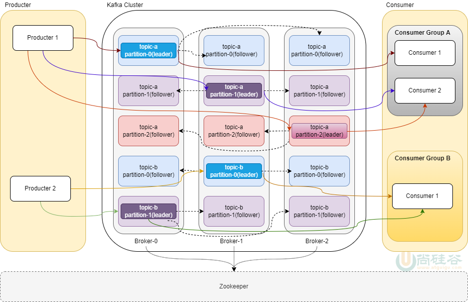

Kafka的核心角色介绍：

| **角色名称                         ** | **具体含义**                                                 |
| ------------------------------------- | ------------------------------------------------------------ |
| Broker                                | Broker是一个kafka实例，简单说就是一台kafka服务器，kafkaCluster表示集群。 |
| Topic                                 | 主题 ,Kafka将**消息进行分类**，每一类的消息称之为一个主题。  |
| Producer                              | 生产者，可以向Broker topic 发布消息的客户端。                |
| Consumer                              | 消费者，从Broker topic 订阅消息的客户端。                    |
| Partition                             | Topic的分区，每个 Topic 可以有多个分区，同一个Topic 在不同分区的数据是不重复的。每个partition都由一系列有序的、不可变的消息组成，这些消息被连续的追加到partition中。**分区作用是做负载，提高 kafka 的吞吐量。** |
| Replication                           | Partition(分区)的副本。每个分区可以有多个Replication，由一个Leader和若干个Follower组成。Leader负责接收生产者push的消息和消费者poll消费消息。Follower会实时从自己的Leader中同步数据保持同步。Leader故障时,某个Follower会上位为新的Leader。**分区副本的作用是保证高可用。** |
| ConsumerGroup                         | 同一个消费者组中的多个消费者**分摊**一个topic中的消息，不同消费者组中的多个消费者**共同**消费一个topic中的相同消息 |
| In-sync Replicas（ISR）               | （ISR）已同步副本：表示存活且副本都已和Leader同步的的broker集合，是Leader所有replicas副本的子集。如果某个副本节点宕机，该副本就会从ISR集合中剔除。 |
| ZooKeeper                             | Kafka使用ZooKeeper来进行集群管理、协调和元数据存储。Kafka中的Broker、Topic、Consumer都会注册到zookeeper。 |


## 2.3 Kafka集群搭建

为了测试方便，我们选择搭建伪分布式Kafka集群，在同一台虚拟机上启动**一个zookeeper实例**，**三个Kafka实例**。并且使用docker compose进行搭建，具体的docker compose文件的内容参考课程资料: **docker-compose-kafka.yml**

访问EFAK账号和密码： admin/123456


## 2.4 Kafka集群测试

**进入任意一个容器：**

```shell
docker exec -it kafka1 /bin/bash
```


**topic操作相关命令**：

```shell
# 创建主题
kafka-topics.sh --create --topic hellokafka-topic --bootstrap-server 192.168.100.102:9092
kafka-topics.sh --create --topic hellokafka-topic1 --bootstrap-server 192.168.100.102:9093

# 建立3个分区并给每个分区建立3个副本
kafka-topics.sh --create --topic myclustertopic --partitions 3 --replication-factor 3 --bootstrap-server 192.168.100.102:9092

# 查看系统中的topic，可以尝试从其他的节点上进操作
kafka-topics.sh --list --bootstrap-server 192.168.100.102:9092

# 查看topic的详情信息
kafka-topics.sh --describe --topic hellokafka-topic --bootstrap-server 192.168.100.102:9092     
```

查询信息说明：

>Topic: 主题名称
>
>TopicId： 主题id
>
>PartitionCount：分区个数
>
>ReplicationFactor：副本数
>
>Configs： 主题配置信息
>
>Partition：分区id
>
>Leader：主分区所在的节点id
>
>Replicas：副本分区所在的节点id
>
>Isr：已同步副本所在的节点id


**发送以及接收消息：**

```shell
# 使用生产者脚本发送消息
kafka-console-producer.sh  --topic hellokafka-topic --bootstrap-server 192.168.100.102:9092

# 使用生产者脚本接收消息
# 从当前位置开始消费
kafka-console-consumer.sh --topic hellokafka-topic --bootstrap-server 192.168.100.102:9092

# --from-beginning: 表示从最开始的位置进行消费消费
kafka-console-consumer.sh --topic hellokafka-topic --from-beginning --bootstrap-server 192.168.100.102:9092
```


注意：EFAK删除主题的时候获取admin token需要进入到容器中，查看system-config.properties配置文件进行获取。

```
docker exec -it eagle /bin/bash
cat conf/system-config.properties


得到如下配置：可知token是keadmin
######################################
# delete kafka topic token
# Set to delete the topic token, so that administrators can have the right to delete
######################################
efak.topic.token=keadmin
```


# 3 Java API入门案例

## 3.1 发送消息

具体步骤如下所示：

1、创建一个kafka-parent父工程，删除src目录，并加入如下依赖：

```xml
<!-- 父工程 ， JDK选择17 -->
<parent>
    <artifactId>spring-boot-starter-parent</artifactId>
    <groupId>org.springframework.boot</groupId>
    <version>3.0.5</version>
</parent>

<!--kafka-clients 2023.8-->
<dependency>
    <groupId>org.apache.kafka</groupId>
    <artifactId>kafka-clients</artifactId>
    <version>3.5.1</version>
</dependency>

<dependency>
    <groupId>org.springframework.boot</groupId>
    <artifactId>spring-boot-starter-test</artifactId>
</dependency>
```

2、在kafka-parent父工程下创建kafka-producer子工程

3、创建启动类

```java
package com.atguigu.kafka;

@SpringBootApplication
public class ProducerApplication {

    public static void main(String[] args) {
        SpringApplication.run(ProducerApplication.class , args) ;
    }

}
```

4、导入课程资料的logback-spring.xml

5、生产者代码实现：

官网示例代码：https://kafka.apache.org/35/javadoc/org/apache/kafka/clients/producer/KafkaProducer.html

测试代码：

```java
// 可以事先不用创建主题，会自动创建
package com.atguigu.kafka;

@SpringBootTest(classes = ProducerApplication.class)
public class ProducerDemo01 {

    // 主题名称
    public static final String TOPIC_NAME = "hellokafka";

    @Test
    public void sendMsg() {

        // 创建生产者属性对象
        Properties properties = new Properties() ;
        properties.put(ProducerConfig.BOOTSTRAP_SERVERS_CONFIG , "192.168.100.102:9092") ;
        properties.put(ProducerConfig.KEY_SERIALIZER_CLASS_CONFIG , "org.apache.kafka.common.serialization.StringSerializer") ;
        properties.put(ProducerConfig.VALUE_SERIALIZER_CLASS_CONFIG , "org.apache.kafka.common.serialization.StringSerializer") ;

        // 创建生产者对象
        KafkaProducer kafkaProducer = new KafkaProducer(properties) ;

        // 调用send方法发送消息
        for (int i = 0; i < 10; i++) {
            // 调用send方法发送消息
            ProducerRecord producerRecord = new ProducerRecord(TOPIC_NAME , "helloKafka~" + i) ;
            kafkaProducer.send(producerRecord) ;
        }

        // 关闭资源
        kafkaProducer.close();

    }

}
```

消息发送完毕以后可以通过eagle系统查看主题消息。


## 3.2 消费消息

具体步骤如下所示：

1、在kafka-parent父工程下创建kafka-consumer子工程

2、创建启动类

```java
package com.atguigu.kafka;

@SpringBootApplication
public class ConsumerApplication {

    public static void main(String[] args) {
        SpringApplication.run(ConsumerApplication.class , args) ;
    }

}
```

3、消费者代码实现：

官网示例代码：https://kafka.apache.org/35/javadoc/org/apache/kafka/clients/consumer/KafkaConsumer.html

测试代码：

```java
package com.atguigu.kafka;

@SpringBootTest(classes = ConsumerApplication.class)
public class ConsumerDemo01 {

    // 定义主题
    public static final String TOPIC_NAME = "hellokafka";

    @Test
    public void consumerMsg() {

        // 创建属性对象
        Properties properties = new Properties() ;
        properties.put(ConsumerConfig.BOOTSTRAP_SERVERS_CONFIG , "192.168.100.102:9092") ;
        properties.put(ConsumerConfig.GROUP_ID_CONFIG , "group01") ;
        properties.put(ConsumerConfig.KEY_DESERIALIZER_CLASS_CONFIG , "org.apache.kafka.common.serialization.StringDeserializer") ;
        properties.put(ConsumerConfig.VALUE_DESERIALIZER_CLASS_CONFIG , "org.apache.kafka.common.serialization.StringDeserializer") ;
        // earliest：最开始第一次向一个topic发消息时，如果没有消费位移，那么此时从最早（最小）偏移量开始读取消息
        // latest：最开始第一次向一个topic发消息时，如果没有消费位移，那么此时从最新（最大）偏移量开始读取消息
        // 查看消费位移的命令如下：
        // kafka-consumer-groups.sh --bootstrap-server localhost:9092 --group group01 --describe
        properties.put(ConsumerConfig.AUTO_OFFSET_RESET_CONFIG , "earliest") ;   

        // 创建消费者对象
        KafkaConsumer kafkaConsumer = new KafkaConsumer(properties) ;

        // 订阅主题
        kafkaConsumer.subscribe(Arrays.asList(TOPIC_NAME));

        while (true) {

            // 消费消息
            ConsumerRecords<String , String> consumerRecords = kafkaConsumer.poll(Duration.ofMillis(100));  // 参数表示拉取消息的时间间隔
            for (ConsumerRecord<String , String> record : consumerRecords) {
                System.out.printf("offset = %d, key = %s, value = %s%n", record.offset(), record.key(), record.value());  // offset表示消费位移
            }

        }

    }

}
```


# 4 Spring Boot集成Kafka

## 4.1 生产者

### 4.1.1 环境搭建

具体步骤如下所示：

1、创建一个spring-kafka父工程，并添加如下依赖

```xml
<parent>
    <artifactId>spring-boot-starter-parent</artifactId>
    <groupId>org.springframework.boot</groupId>
    <version>3.0.5</version>
</parent>

<dependencies>
    
    <!-- web开发起步依赖 -->
    <dependency>
        <groupId>org.springframework.boot</groupId>
        <artifactId>spring-boot-starter-web</artifactId>
    </dependency>

    <!-- lombok依赖 -->
    <dependency>
        <groupId>org.projectlombok</groupId>
        <artifactId>lombok</artifactId>
        <optional>true</optional>
    </dependency>
    
    <!-- spring boot和junit整合时候的起步依赖 -->
    <dependency>
        <groupId>org.springframework.boot</groupId>
        <artifactId>spring-boot-starter-test</artifactId>
        <scope>test</scope>
    </dependency>
    
    <!--spring-kafka-->
    <dependency>
        <groupId>org.springframework.kafka</groupId>
        <artifactId>spring-kafka</artifactId>
    </dependency>
    
    <!--hutool-->
    <dependency>
        <groupId>cn.hutool</groupId>
        <artifactId>hutool-all</artifactId>
        <version>5.8.19</version>
    </dependency>
    
</dependencies>

<build>
    <plugins>
        <plugin>
            <groupId>org.springframework.boot</groupId>
            <artifactId>spring-boot-maven-plugin</artifactId>
            <configuration>
                <excludes>
                    <exclude>
                        <groupId>org.projectlombok</groupId>
                        <artifactId>lombok</artifactId>
                    </exclude>
                </excludes>
            </configuration>
        </plugin>
    </plugins>
</build>
```

2、在spring-kafka父工程下创建spring-kafka-producer子工程

3、创建启动类

```java
package com.atguigu.kafka;

@SpringBootApplication
public class ProducerApplication {

    public static void main(String[] args) {
        SpringApplication.run(ProducerApplication.class , args) ;
    }

}
```

4、在spring-kafka-producer子工程中添加application.yml配置文件，并且添加如下配置内容

```yml
# application.yml
server:
  port: 8081

# 生产者配置
spring:
  kafka:
    bootstrap-servers: 192.168.100.102:9092,192.168.100.102:9093,192.168.100.102:9094
    producer:
      acks: -1
      retries: 0
      batch-size: 16384 # 批次大小 单位byte
      buffer-memory: 33554432
      compression-type: gzip
      key-serializer: org.apache.kafka.common.serialization.StringSerializer # key的序列化器
      value-serializer: org.apache.kafka.common.serialization.StringSerializer # value的序列化器
      properties: {
        'linger.ms': 10
      }   # 配置其他的属性
```

5、创建主题配置类

```java
package com.atguigu.kafka.config;

@Configuration
public class KafkaConfig {

    @Bean
    public NewTopic springTestTopic(){
        return TopicBuilder.name("topic-01") //主题名称
                .partitions(3) //分区数量
                .replicas(3) //副本数量
                .build();
    }
}
```

6、启动主类

7、启动程序通过eagle查看主题创建情况


### 4.1.2 发送消息

创建测试类通过**KafkaTemplate**发送消息,代码如下所示：

```java
package com.atguigu.kafka.test
    
@SpringBootTest(classes = ProducerApplication.class)
public class ProducerApplicationTest {

    @Autowired
    private KafkaTemplate kafkaTemplate ;

    @Test
    public void send() {
        kafkaTemplate.send("topic-01" , "kafka...producer...send...message...") ;
    }

}
```

执行测试代码，通过Eagle控制台可以查看到消息发送成功。


### 4.1.3 发送方式

生产者发送消息存在三种方式：

#### 1、不关心发送结果

把消息发送给服务器，但并不关心它是否正常到达。此种发送消息的方式kafka**吞吐量**最高的一种方式，生产者发送消息后，不需要等待服务器的响应。但是，此种发送消息的方式也是**最不可靠**的一种方式，因为对于发送失败的消息没有做任何处理。

```java
// 入门案例的消息发送方式就是该方式
kafkaTemplate.send("topic-01" , "kafka...producer...send...message...") ;
```

特点：性能最好，可靠性最差。


#### 2、同步消息发送

使用send()方法发送消息，它会返回一个CompletableFuture对象，**get方法会一直阻塞直到该线程的任务得到返回值，也就是broker返回发送成功**。如果业务上关心发送结果，那么可以使用同步发送的方式。

```java
// 实现通过消息发送就需要在调用完send方法以后，再次调用get方法
kafkaTemplate.send("topic-01" , "kafka...producer...send...message...").get() ;
```

特点：性能最差，可靠性较好。


#### 3、异步消息发送

调用send()方法，并指定一个回调函数，**服务器在返回响应时调用该回调函数**。

如果业务上关心发送结果，且需要异步发送，那么可以用异步+回调的方式来发送消息。

注意：由于是异步发送消息，测试的时候可以让线程休眠一会儿以等待回调函数的执行

```java
// 要实现异步消息发送就需要定义生产者监听器，在发送完毕以后就会根据具体的发送结果调用对应的函数，如下所示：
package com.atguigu.kafka.listener;

@Component
@Slf4j
public class KafkaSendResultHandler implements ProducerListener {

    /**
     * Kafka发送成功回调
     * @param producerRecord
     * @param recordMetadata
     */
    @Override
    public void onSuccess(ProducerRecord producerRecord, RecordMetadata recordMetadata) {
        String topic = producerRecord.topic();
        String value = producerRecord.value().toString();
        Integer partition = recordMetadata.partition();
        log.info("topic：{}，value：{}，partition：{}， 发送成功回调",topic,value, partition);
    }

    @Override
    public void onError(ProducerRecord producerRecord, RecordMetadata recordMetadata, Exception exception) {
        String topic = producerRecord.topic();
        String value = producerRecord.value().toString();
        log.info("topic：{}，value：{}， 发送失败，原因：{}",topic,value,exception.getMessage());
    }
}
```


### 4.1.4 拦截器配置

Kafka支持在发送消息之前和之后进行拦截，自定义业务逻辑。

具体使用步骤：

1、创建拦截器

```java
package com.atguigu.kafka.interceptor;

public class CustomProducerInterceptor implements ProducerInterceptor<String , String> {

    // 发送消息之前的切面拦截
    @Override
    public ProducerRecord<String, String> onSend(ProducerRecord<String, String> record) {
        System.err.println("生产者发送前置方法！");
        String value = "prefix："+ record.value();
        return new ProducerRecord(record.topic(), record.partition(), record.timestamp(), record.key(), value, record.headers());
    }

    //	发送消息之后的切面拦截
    @Override
    public void onAcknowledgement(RecordMetadata metadata, Exception exception) {
        System.err.println("生产者发送后置方法！");
    }

    // 是生产者关闭前调用的方法
    @Override
    public void close() {
        System.err.println("close方法执行了...");
    }

    // 是拦截器用于配置一些属性的方法
    @Override
    public void configure(Map<String, ?> configs) {

    }
}
```

2、配置拦截器

```yaml
spring:
  kafka:
    bootstrap-servers: 192.168.136.146:9092,192.168.136.146:9093,192.168.136.146:9094
    producer:
      acks: -1
      retries: 0
      batch-size: 16384 # 批次大小 单位byte
      compression-type: gzip
      key-serializer: org.apache.kafka.common.serialization.StringSerializer # key的序列化器
      value-serializer: org.apache.kafka.common.serialization.StringSerializer # value的序列化器
      properties: {
        'linger.ms': 10 ,
        'interceptor.classes' : "com.atguigu.kafka.interceptor.CustomProducerInterceptor" 
      }   # 配置其他的属性
```

启动测试程序进行测试。


### 4.1.5 使用CompletableFuture

```java
@Test
public void sendMessage() {
    CompletableFuture<SendResult<String, Object>> completableFuture = kafkaTemplate.send("topic-01", "kafka...producer...send...message...");
    //执行成功回调
    completableFuture.thenAccept(result -> {
        log.info("kafka发送消息成功");
    });
    
    //执行失败回调
    completableFuture.exceptionally(e -> {
        //发送失败，记录日志或者采取重发策略
        log.info("kafka发送消息失败");
        e.printStackTrace();
        return null;
    });
}
```


### 4.1.6 分区

1、未指定key和partition

**未指定key**：Kafka采用Sticky Partition（黏性分区）, 会随机选择一个分区，并尽可能一直使用该分区，待该分区的batch（默认16k）已满或者已完成，Kafka再随机一个分区进行使用（和上一次的分区不同）

```java
@Test
public void sendPartition01() throws ExecutionException, InterruptedException {
    for (int i = 0; i < 100; i++) {
        kafkaTemplate.send("topic-01" , "hello" + i).get() ;//get确保顺序
    }
}
```


2、指定partition

```java
@Test
public void sendPartition02() {
    kafkaTemplate.send("topic-01" , 0, null, "hello");
}
```


3、指定key

**指定key**：使用murmur2hash算法计算key的hash值与topic的partition数进行取余得到partition值

例如：key1的hash值=5， key2的hash值=6 ，topic的partition数=2，那么key1 对应的value1写入1号分区(5÷2余数1)，key2对应的value2写入0号分区(6÷2余数0)。

```java
@Test
public void sendPartition03() throws ExecutionException, InterruptedException {

    for (int i = 0; i < 5; i++) {
        kafkaTemplate.send("topic-01" , "a","hello~a~" + i).get() ;
    }
    for (int i = 0; i < 5; i++) {
        kafkaTemplate.send("topic-01" , "b","hello~b~" + i).get() ;
    }
}
```


2、指定分区器：

指定轮询分区器：

```yml
spring:
  kafka:
    bootstrap-servers: 192.168.136.146:9092,192.168.136.146:9093,192.168.136.146:9094
    producer:
      acks: -1
      retries: 0
      batch-size: 16384 # 批次大小 单位byte
      compression-type: gzip
      key-serializer: org.apache.kafka.common.serialization.StringSerializer # key的序列化器
      value-serializer: org.apache.kafka.common.serialization.StringSerializer # value的序列化器
      properties: {
        'linger.ms': 10 ,
        'interceptor.classes' : "com.atguigu.kafka.interceptor.CustomProducerInterceptor" ,
        'partitioner.class': "org.apache.kafka.clients.producer.RoundRobinPartitioner"
      }   # 配置其他的属性
```

测试：

```java
@Test
public void sendPartition04() throws ExecutionException, InterruptedException {
    for (int i = 0; i < 10; i++) {
        kafkaTemplate.send("topic-01" , "hello~" + i).get() ;
    }
}
```


3、自定义分区器

定义分区器

```java
package com.atguigu.kafka.partitioner;

public class CustomPartitioner implements Partitioner {

    @Override
    public int partition(String topic, Object key, byte[] keyBytes, Object value, byte[] valueBytes, Cluster cluster) {

        // 获取消息
        String msgValue = value.toString();


        if (msgValue.contains("atguigu")) {   // 大于1个分区,消息中包含atguigu的消息发往0号分区
            System.out.println("消息发访问0号分区....");
            return 0;
        }

        // 其他消息随机发往其他的分区
        // 获取可用的分区
        List<PartitionInfo> partitionInfos = cluster.availablePartitionsForTopic(topic);
        int partitionCount = partitionInfos.size();
        Random random = new Random() ;
        //输出一个在 1 和 partitionCount - 1 之间的随机整数（包括 1，但不包括 partitionCount）
        int index = random.nextInt(1, partitionCount);
        System.out.println("消息访问" + index +"号分区....");
        return index;
    }

    @Override
    public void close() {

    }

    @Override
    public void configure(Map<String, ?> configs) {

    }

}
```

配置：

```yaml
'partitioner.class': "com.atguigu.kafka.partitioner.CustomPartitioner"
```

测试：

```java
@Test
public void sendPartition05() throws ExecutionException, InterruptedException {

    for (int i = 0; i < 10; i++) {
        kafkaTemplate.send("topic-01" , "atguigu~" + i).get() ;
    }
    for (int i = 0; i < 10; i++) {
        kafkaTemplate.send("topic-01" , "hello~" + i).get() ;
    }
}
```


### 4.1.7 生产者常见属性

生产者还有很多可配置的参数，在 Kafka文档里都有说明，它们大部分都有合理的默认 值，所以没有必要去修改它们 。不过有几个参数在内存使用、性能和可靠性方面对生产者影响比较大，接下来我们会一一说明。

官网地址：https://kafka.apache.org/28/documentation.html#producerconfigs

#### batch.size

作用：该参数指定了一个批次(ProducerBatch)可以使用的内存大小，按照字节数计算（而不是消息个数）。当批次被填满， 批次里的所有消息会被发送出去。默认值为16384byte(16K)

#### linger.ms

作用：该参数指定了生产者在发送批次之前等待更多消息加入批次的时间 。KafkaProduce会在批次填满或linger.ms达到上限时把批次发送出去。

默认值为0：意思就是消息必须立即被发送，但这样会影响性能，一般设置10毫秒左右，就是说这个消息发送完后会进入本地的一个batch，如果10毫秒内，这个batch满了16kb就会随batch一起被发送出去。如果10毫秒内，batch没满，那么也必须把消息发送出去，不能让消息的发送延迟时间太长！

#### buffer.memory

设置发送消息的本地缓冲区，消息会先发送到本地缓冲区，可以提高消息发送性能，默认值是33554432，即32MB

#### compression.type

Kafka 的消息压缩是指将消息本身采用特定的压缩算法进行压缩并存储，待消费时再解压。提高了消息的传输效率并且降低了存储压力。

**Kafka中提供了四种压缩算法，对比如下所示：CPU资源充足，带宽资源有限时可以考虑使用压缩算法压缩消息。**

| 压缩类型 | 压缩比率 | CPU 使用率 | 压缩速度 | 带宽使用率 |
| -------- | -------- | ---------- | -------- | ---------- |
| gzip     | 高       | 高         | 慢       | 低         |
| snappy   | 一般     | 一般       | 一般     | 一般       |
| lz4      | 低       | 低         | 快       | 高         |
| zstd     | 一般     | 一般       | 一般     | 一般       |

#### acks

acks保证生产者可以将消息可靠的发送到达broker。

常见取值说明：

1、acks=0：生产者发送过来数据，就不管了，可靠性差数据会丢，效率最高

2、acks=1：生产者发送过来数据，只需要Leader确认即可返回，可靠性中等，效率中等

3、acks=-1(all)：生产者发送过来数据，Leader和ISR队列里面所有Follwer应答，可靠性高效率最低


在生产环境中选择：

1、acks=0，很少使用

2、acks=1，一般用于传输普通日志，允许丢个别数据；

3、aks=-1(all)，一般用于传输重要不能丢失的数据(例如：钱、订单、积分等)，对可靠性要求比较高的场景。

#### retries

kafka是一种分布式消息系统，常用于大规模数据的收集和分发。在生产者发送消息到kafka集群的过程中，由于多种原因（网络故障、消息格式问题等），可能会发生消息发送失败。为了提高消息传输的可靠性，kafka提供了一种重试机制，即当消息发送失败时，会自动尝试重新发送直到消息成功被写入kafka。


## 4.2 消费者

### 4.2.1 环境搭建

具体步骤如下所示：

1、在spring-kafka父工程下创建spring-kafka-consumer子工程

2、创建启动类

```java
package com.atguigu.kafka;
@SpringBootApplication
public class ConsumerApplication {

    public static void main(String[] args) {
        SpringApplication.run(ConsumerApplication.class , args) ;
    }

}
```

3、创建主题配置类

```java
package com.atguigu.kafka.config;
@Configuration
public class KafkaConfig {

    @Bean
    public NewTopic springTestTopic(){
        return TopicBuilder.name("topic-01") //主题名称, 该主题不存在直接创建，如果存在就复用
                .partitions(3) //分区数量
                .replicas(3) //副本数量
                .build();
    }
}
```

4、在application.yml文件中添加如下配置

```yml
server:
  port: 8120

# 消费者配置
spring:
  Kafka:
    bootstrap-servers: 192.168.100.102:9092,192.168.100.102:9093,192.168.100.102:9094
    consumer: # consumer消费者配置
      group-id: group03 # 默认的消费组ID
      enable-auto-commit: true # 是否进行自动offset提交
      auto-commit-interval: 5000 # 自动提交offset时间间隔5s。这期间服务异常停止时，再次重启会导致重复消费
      auto-offset-reset: earliest
      key-deserializer: org.apache.kafka.common.serialization.StringDeserializer
      value-deserializer: org.apache.kafka.common.serialization.StringDeserializer
```

### 4.2.2 接收消息

```java
package com.atguigu.kafka.listener;
@Component
public class KafkaListeners {

    /**
     * 简单消费：
     * topics：消费的主题列表
     * ConsumerRecord<String, String> record: 记录对象,封装消息记录的相关数据
     */
    @KafkaListener(topics = {"topic-01"})
    public void simpleConsumer(ConsumerRecord<String, String> record ) {
        System.out.println("进入simpleConsumer方法");
        System.out.printf(
                "分区 = %d, 偏移量 = %d, key = %s, 内容 = %s, 时间戳 = %d%n",
                record.partition(),
                record.offset(),
                record.key(),
                record.value(),
                record.timestamp()
        );
    }

}
```


### 4.2.3 手动位移提交

```java
//消费者KafkaConfig
@Bean
public NewTopic springTestTopic2(){
    return TopicBuilder.name("topic-02") //主题名称, 该主题不存在直接创建，如果存在就复用
        .partitions(3) //分区数量
        .replicas(3) //副本数量
        .build();
}
```


4、消费者消息消费完毕以后，进行位移提交

```java
//KafkaListeners
@KafkaListener(topics = {"topic-02"})
public void simpleConsumer(ConsumerRecord<String, String> record , Consumer consumer) {
    System.out.println("进入simpleConsumer方法");
    System.out.printf(
        "主题 = %s, 分区 = %d, 偏移量 = %d, key = %s, 内容 = %s, 时间戳 = %d%n",
        record.topic(),
        record.partition(),
        record.offset(),
        record.key(),
        record.value(),
        record.timestamp()
    );

    consumer.commitAsync();         // 进行手动位移提交
}
```

5、生产者测试

```java
@Test
public void sendTopic02() {
    kafkaTemplate.send("topic-02" , 0, null, "hello0");
    kafkaTemplate.send("topic-02" , 1, null, "hello1");
    kafkaTemplate.send("topic-02" , 2, null, "hello2");
}
```


### 4.2.4 消费异常处理

当消费者对消息消费时，如果发生了异常当然也需要处理一下异常。一般我们在@KafkaListener中，只是监听topic中的主题并消费，如果再**try catch捕获并处理**的话，则会显得代码块非常臃肿不利于维护，kafka为我们提供了专门的异常处理器**ConsumerAwareListenerErrorHandler**，通过它我们可以处理consumer在消费时发生的异常。

具体使用步骤如下所示：

1、在spring容器中配置ConsumerAwareListenerErrorHandler

```java
package com.atguigu.kafka.config;
@Configuration
public class CustomListenerErrorHandler {

    @Bean
    public ConsumerAwareListenerErrorHandler listenerErrorHandler(){
        return (Message<?> message, ListenerExecutionFailedException exception, Consumer<?, ?> consumer) -> {
            System.out.println("--- 消费时发生异常 ---");
            return null;
        } ;
    }

}
```

2、消费者使用异常处理器

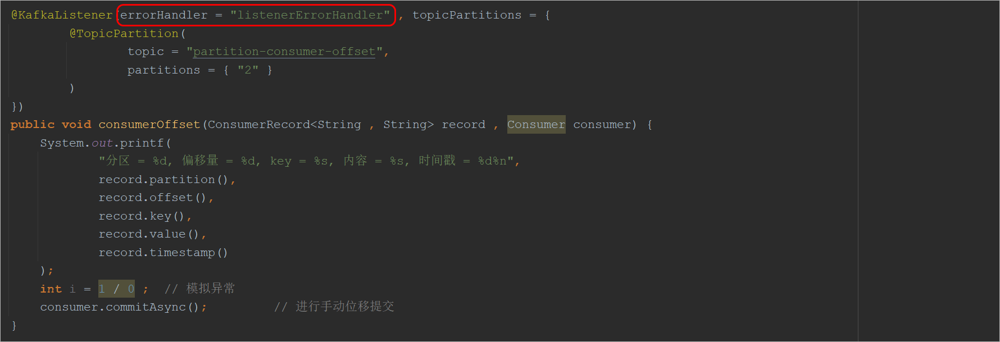 


# 5 MQ高级内容

## 5.1 消息可靠性传输

消息的可靠性传输：指消息在整个传输过程中保证消息不丢失。

消息传输过程回顾：


整个传输过程分为三个阶段：

1、生产者发生消息到MQ

2、MQ收到消息保存消息

3、消费者从MQ中获取消息进行消费

可靠性保证：

① 首先需要确保生产者是正常的将消息发给了MQ，可以将**acks的值设置为all**

② 其次要保证MQ中消息的高可用，可以针对**一个分区创建多个副本**，并且将多个副本分散存储到kafka cluster中的每一个节点上

③ 消费者可以将自动位移提交更改为**手动位移提交**


## 5.2 消息顺序消费问题

Kafka发送消息的时候，需要通过分区器对消息进行处理，然后将消息发送到指定的分区中：

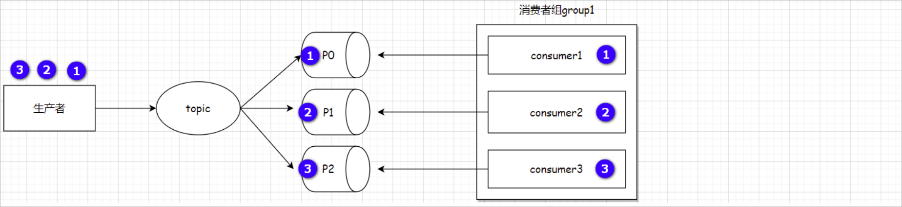 

上述生产者发送了3个消息分别是① ② ③；假设三个消息被分发到了不同的分区中，此时三个消费者分别从每一个分区中获取消息，由于每一个消费者的消费能力可能不同，因此在进行消费的时候可能会出现如下顺序：③ ① ② 就导致消息不是顺序性消费。

解决思路：将消息发送到**同一个分区**，可以保证消息的局部有序，因为**Kafka可以保证同一个分区的消息是严格有序的，然后设置retries等于0**。(如果不把retries设置为0，某批次的数据发送失败后，进行了重试，也可能出现后边的批次先于它到达的情况)


解决方案：

方案一：针对一个topic只创建一个分区

方案二：通过key将相同类型的消息发送到同一个分区中

```java
@Test
public void sendMsgOffset() throws ExecutionException, InterruptedException {
    SendResult sr1 = (SendResult) kafkaTemplate.send("partition-consumer-offset" , "order-1" , "msg03....").get() ;
    SendResult sr2 = (SendResult) kafkaTemplate.send("partition-consumer-offset" , "order-1" , "msg04....").get() ;
    System.out.println(sr1.getRecordMetadata().partition());
    System.out.println(sr2.getRecordMetadata().partition());
}

// 注意：需要使用默认的分区器
```


## 5.3 消息重复消费问题

导致出现消息重复消费的情况：

1、生产者重复发送消息

2、消费者重复消费消息

### 5.3.1 生产者重复发送消息

#### 原因说明

生产者发送的消息没有收到Broker正确的响应，导致生产者重试。

生产者发出一条消息，Broker落盘以后因为网络等种种原因，发送端得到一个发送失败的响应或者网络中断，然后生产者收到一个可恢复的 Exception 重试消息导致消息重复。

#### 重试过程

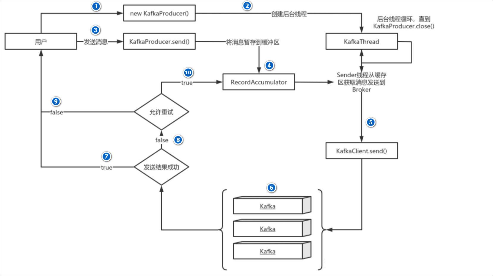 

主要流程说明：

1、new KafkaProducer() 后创建一个后台线程 KafkaThread 负责发送消息到Kafka集群

2、调用 KafkaProducer.send() 发送消息，实际上只是把消息保存到 RecordAccumulator 中；

3、RecordAccumulator 某一个批次被填满或者等待时间超过了所设定的阈值的时候，此时KafkaThread 线程就开始拉取消息，发送消息到Kafka集群

4、如果发送成功，那么返回成功；

5、如果发送失败，那么判断是否允许重试。如果不允许重试，那么返回失败的结果；如果允许重试，把消息再保存到 RecordAccumulator 中，等待后台线程 KafkaThread 再次发送。

#### Kafka的三种消息语义

在Kafka中消息存在三种语义：

1、最多一次（At most once）：消息可能会丢失，但绝不会被重复发送      ---->  Producer禁止重试

2、至少一次（At least once）：消息不会丢失，但有可能被重复发送       ---->  Producer开启了重试机制，当发送的消息没有收到Kafka集群成功的应答时会再次发送数据

3、仅有一次（Exactly once）：消息不会丢失，也不会被重复发送          ---->  Kafka通过**幂等性**和**事务**这两个机制保证了精准一次


#### 生产者幂等性

生产者幂等性就是指Producer不论向Broker发送多少次重复数据，Broker端都只会持久化一条，保证了不重复。

> 1、引入幂等性前，消息发送过程

Producer向Broker发送消息，然后Broker将消息追加到消息流中后再给Producer返回Ack信号值。

实现流程如下:

 

生产中，会出现各种不确定的因素，比如在Producer在发送给Broker的时候出现网络异常。比如以下这种异常情况的出现：

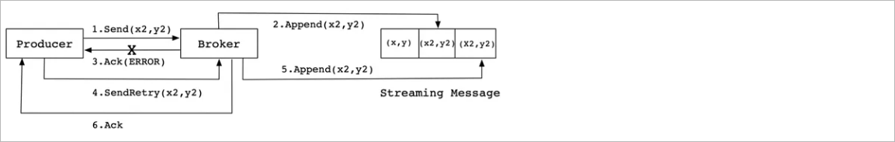 

上图这种情况，当 Producer 第一次发送消息给 Broker 时，Broker 将消息 (x2,y2) 追加到了消息流中， 但是在返回 Ack 信号给 Producer 时失败了（比如网

络异常） 。此时，Producer 端触发重试机制，将消息 (x2,y2) 重新发送给 Broker，Broker 接收到消息后，再次将该消息追加到消息流中，然后成功返回 Ack 信号给 Producer。这样下来，消息流中就被重复追加了两条相同的 (x2,y2) 的消息。

> 2、引入幂等性后，消息发送过程

Kafka为了实现幂等性，在 0.11.0 版本之后，它在底层设计架构中引入了ProducerID和SequenceNumber。

1、ProducerID：在每个新的 Producer 初始化时，会被分配一个唯一的 ProducerID，这个 ProducerID 对客户端使用者是不可见的。

2、SequenceNumber：对于每个 ProducerID，Producer **发送数据**的每个 Topic 和 Partition 都对应一个从 0 开始单调递增的 SequenceNumber 值。

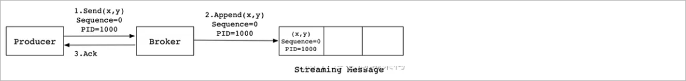 

同样，这是一种理想状态下的发送流程。实际情况下，会有很多不确定的因素，比如 Broker在发送Ack信号给Producer时出现网络异常，导致发送失败。

异常情况如下图所示：

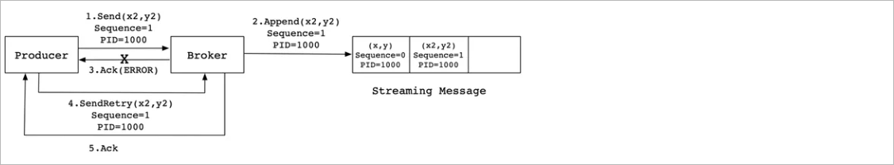 

当 Producer 发送消息 (x2,y2) 给 Broker 时，Broker 接收到消息并将其追加到消息流中。此时，Broker 返回 Ack 信号给 Producer 时，发生异常导致 

Producer 接收 Ack 信号失败。对于 Producer 来说，会触发重试机制，将消息 (x2,y2) 再次发送，但是，**由于引入了幂等性**，在每条消息中附带

PID(ProducerID) 和 SequenceNumber。相同的 PID 和 SequenceNumber 发送给 Broker，**而之前 Broker 缓存过之前发送的相同的消息**，那么在消息流中

的消息就只有一条 (x2,y2)，不会出现重复发送的情况。


幂等性配置说明：

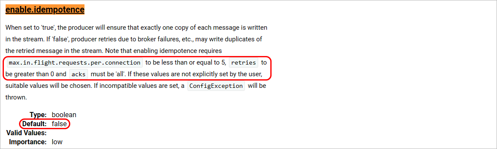 

幂等性完整配置：

```yaml
spring:
  kafka:
    bootstrap-servers: 192.168.100.102:9092,192.168.100.102:9093,192.168.100.102:9094
    producer:
      acks: -1		# 幂等性配置必须为-1
      retries: 1	# 幂等性配置要求，重试次数 > 0
      batch-size: 16384 # 批次大小 单位byte
      compression-type: gzip
      key-serializer: org.apache.kafka.common.serialization.StringSerializer # key的序列化器
      value-serializer: org.apache.kafka.common.serialization.StringSerializer # value的序列化器
      properties: {
        'linger.ms': 10 ,
        'interceptor.classes' : "com.atguigu.kafka.interceptor.CustomProducerInterceptor" ,
        'partitioner.class': "org.apache.kafka.clients.producer.internals.DefaultPartitioner" ,
        'enable.idempotence': "true",
        'max.in.flight.requests.per.connection': 5  # 幂等性配置要求该值必须小于或者等于5
      }   # 配置其他的属性
```

注意：**幂等生产者只能保证单个主题的单一分区内消息不重复**；其次，它只能实现单会话上的幂等性，不能实现跨会话的幂等性，这里的会话即可以理解为：Producer 进程的一次运行。当重启了 Producer 进程之后，则幂等性保证就失效了。如果我想实现多分区以及多会话上的消息无重复，应该怎么做呢？答案就是事务！


#### 生产者事务消息

Kafka的事务特性本质上是支持了Kafka跨分区和Topic的原子写操作。通过事务机制，KAFKA 可以实现对多个 topic 的多个 partition 的原子性的写入，即处于同一个事务内的所有消息，不管最终需要落地到哪个 topic 的哪个 partition, 最终结果都是**要么全部写成功，要么全部写失败**（Atomic multi-partition 

writes）


> 生产者事务演示

1、在配置文件中添加事务相关配置

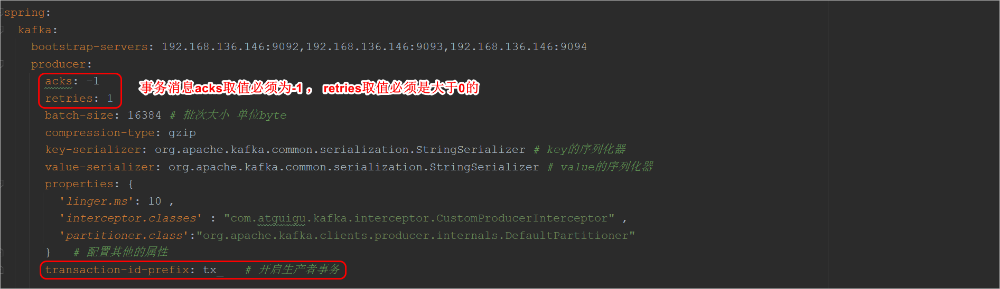 

2、代码演示

```java
// @Transactional          // 方式一需要添加该注解，但是添加该注解事务会自动回滚
@Test
public void sendMsgTransaction() throws ExecutionException, InterruptedException {

    // 方式一
    /*kafkaTemplate.send("topic-02" , 0 , null , "msg11....") ;
        int a = 1 / 0 ;
        kafkaTemplate.send("topic-02" , 1 , null , "msg12....") ;*/

    // 方式二
    kafkaTemplate.executeInTransaction(operations -> {
        operations.send("topic-02" , 0 , null , "msg09....") ;
        int a = 1 / 0 ;
        operations.send("topic-02" , 1 , null , "msg10....") ;
        return true ;
    }) ;

}
```

注意：**Kafka事务的回滚**，并不是删除已写入的数据，而是将写入数据的事务标记为 Rollback/Abort 从而在读数据时过滤该数据。


### 5.3.2 消费者重复消费消息

解决方案：

1、进行手动位移提交

2、消费端做幂等性处理


常见的幂等性解决方案：

A. 比如我们获取到数据操作数据库，你先根据某个字段查一下数据库，如果这数据都有了，你就别插入了，执行以下update操作

B. 比如我们消费的数据需要写Redis，那没问题了，反正每次都是set，天然幂等性。

C. 比如你不是上面两个场景，那做的稍微复杂一点，你需要让生产者发送每条数据的时候，里面加一个全局唯一的 id，类似订单 id 之类的东西，然后你这里消费到了之后，先根据这个id去比如 Redis里查一下，之前消费过吗？如果没有消费过，你就处理，然后这个id写 Redis。如果消费过了，那你就别处理了，保证别重复处理相同的消息即可。

D. 比如基于数据库的唯一键来保证重复数据不会重复插入多条。因为有唯一键约束了，重复数据插入只会报错，不会导致数据库中出现脏数据。

